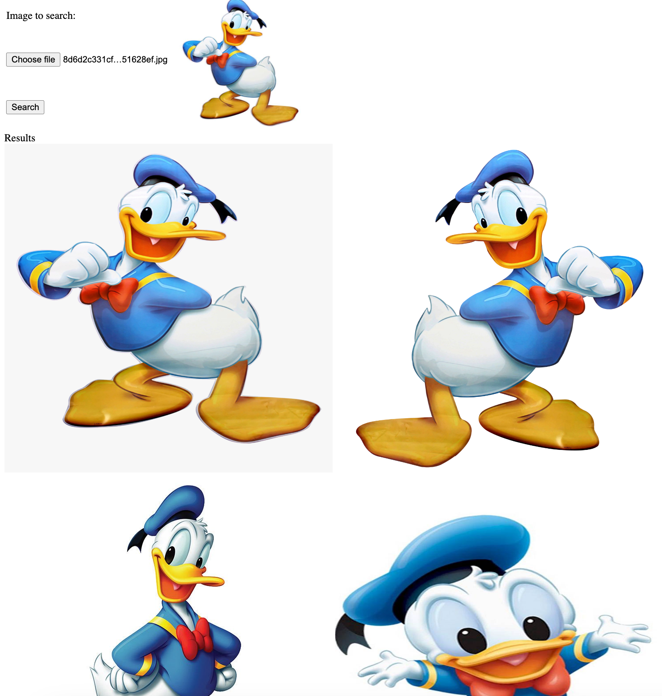
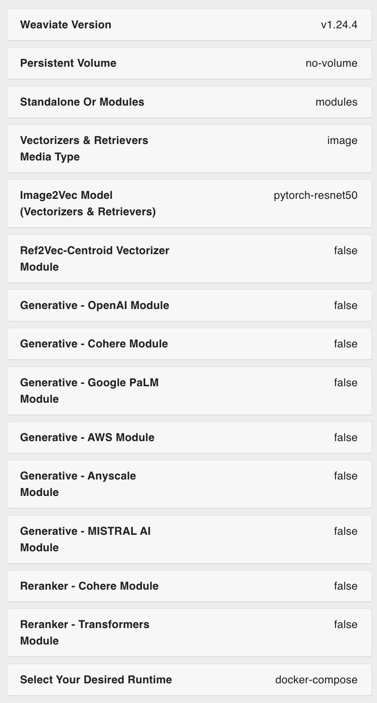
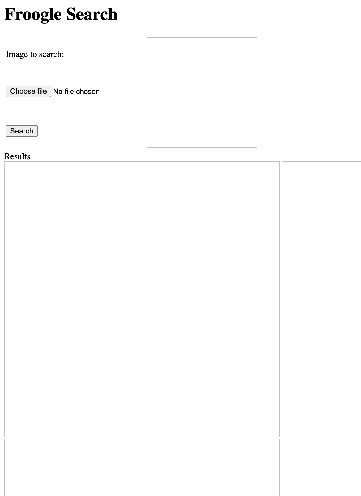

# Weaviate Image Search
This is a simple image search app. It uses an image dataset from Kaggle (consisting of disney cartoon characters) and stores them in a vector database (Weaviate) by using `img2vec` vectorizer.  
The frontend is a simple HTML page. It allows you to select an image file and then searches similar images from the dataset.  





## Steps to follow

1. Run Weaviate Database with `img2vec` vectorizer model.  
The easiest way to get Weaviate running locally is to use the `Configurator`.  
For that go to: https://weaviate.io/developers/weaviate/installation/docker-compose.  
Then scroll down to `Configurator` and select the values in the prompts that appear according to the image below:  

  

This will generate a curl command to download a docker-compose file.  
Use that or use this command to download:
```
curl -o docker-compose.yml "https://configuration.weaviate.io/v2/docker-compose/docker-compose.yml?generative_anyscale=false&generative_aws=false&generative_cohere=false&generative_mistral=false&generative_openai=false&generative_palm=false&image_neural_model=pytorch-resnet50&media_type=image&modules=modules&ref2vec_centroid=false&reranker_cohere=false&reranker_transformers=false&runtime=docker-compose&weaviate_version=v1.24.4&weaviate_volume=no-volume"
```
Then run the below command:  
`docker-compose up -d`  
This will create two docker containers: a weaviate database and an `img2vec` vectorizer.  
You can verify this by going to this url: http://localhost:8080/v1.  
This should show some JSON like this:
```
{
   "links": [
       {
           "href": "/v1/meta",
           "name": "Meta information about this instance/cluster"
       },
       {
           "documentationHref": "https://weaviate.io/developers/weaviate/api/rest/schema",
           "href": "/v1/schema",
           "name": "view complete schema"
       },
       {
           "documentationHref": "https://weaviate.io/developers/weaviate/api/rest/schema",
           "href": "/v1/schema{/:className}",
           "name": "CRUD schema"
       },
       {
           "documentationHref": "https://weaviate.io/developers/weaviate/api/rest/objects",
           "href": "/v1/objects{/:id}",
           "name": "CRUD objects"
       }
   ]
}
```
2. Clone this repo and go to `weaviate-image-search` directory
3. Download image files.  
I have used this dataset: https://www.kaggle.com/datasets/sayehkargari/disney-characters-dataset. But you could use anything as long as you put them in the right directory/sub-directories.  
In order for this app to just work, download the dataset and copy the contents of `/cartoon/train` directory to `/src/main/resources/data` directory.  
So the `resources` directory looks like this:
```
   resources
      └ data
          ├ donald
          ├ mickey
          ├ minion
          ├ olaf
          ├ pooh
          └ pumba
   Each of these subdirectories contain .jpg, .png etc. files.
```
4. From `weaviate-image-search` directory, run this spring-boot app. (Make sure you are using JDK21.)
```
mvn spring-boot:run
```
When you are running it first time, it takes quite some time (few minutes to embed and store all 4155 image files).  
5. Go to `localhost:8000/index.html` and it should show a screen like this:  



6. Click 'Choose file' and select one of the files from the `test` part of dataset. the dataset has two directories. Earlier we used `/train` directory, and now we use an image file from `/test` directory, so it is a different image from the trained images.  
7. Then click Search and you should see similar images.

